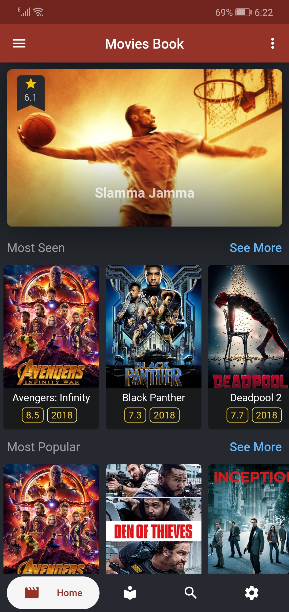
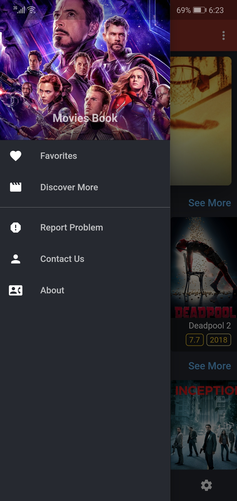
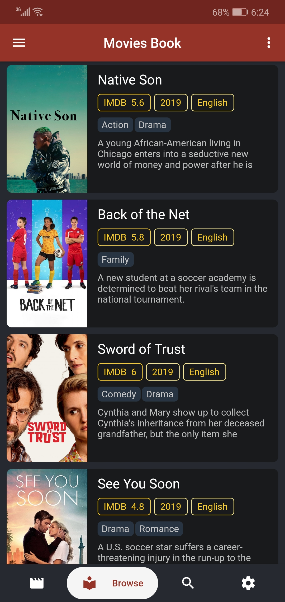
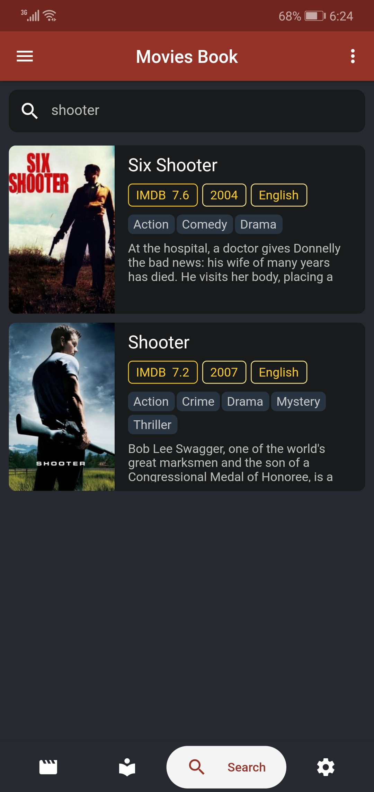
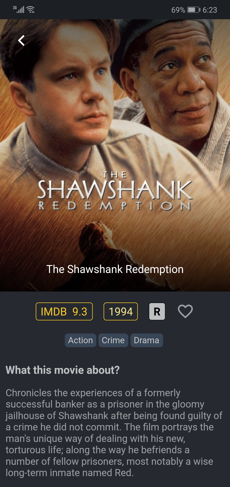
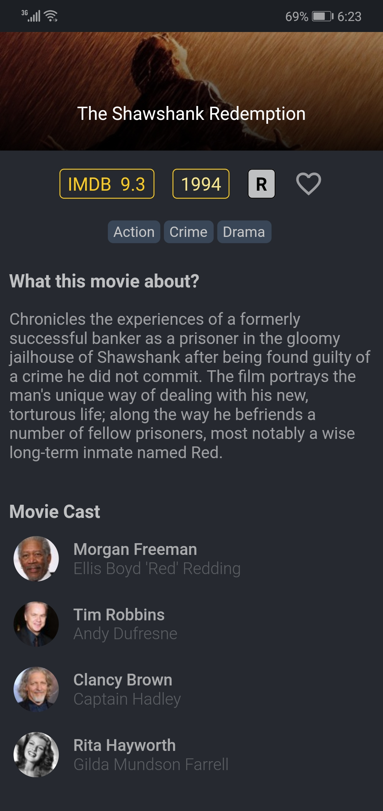
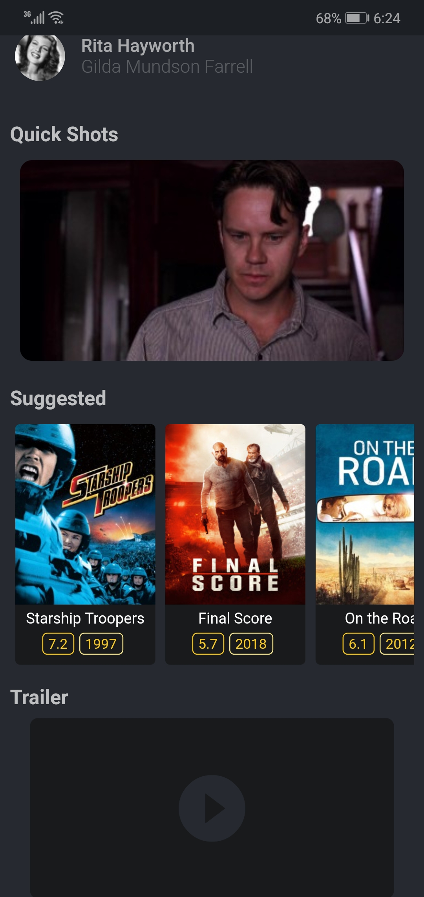
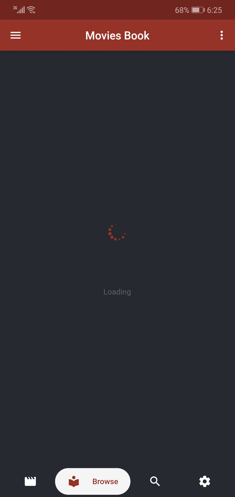
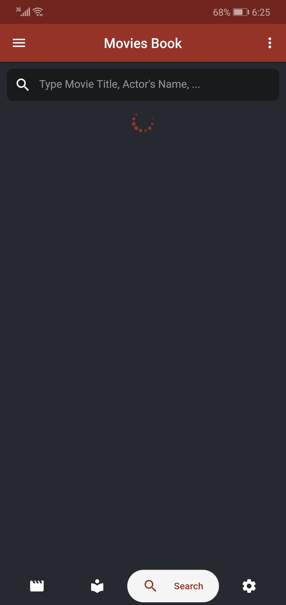

# Movies Book
## Movies app built using Flutter framework
This is a flutter app works absolutely fine on both (Android/IOS) since we're dealing with 
[Flutter]("https://flutter.dev/") and 
[Dart]("https://dart.dev/")

### Couple things you may have to consider:
1- This project was Migrated to AndroidX  
2- This project contains some additional folders named as (assetss/images) for required images inside the app, (fonts) for future need, and (Screenshots)
 

### Update or Modify the project
You actually don't have to do anything, download this whole project, open it inside [VS Code]("https://code.visualstudio.com/") and start do what ever.
  

### Here are some screenshots after successful built on [Huawei Nova3 - Android version: 9]
#### Home Page

#### Browse & Search Pages

#### Movie Details, Cast, Suggested...

#### Favorites, Loading

### last: see the [pupspec.yaml] for the dependencies and packages used in this app
### Enjoy :)
